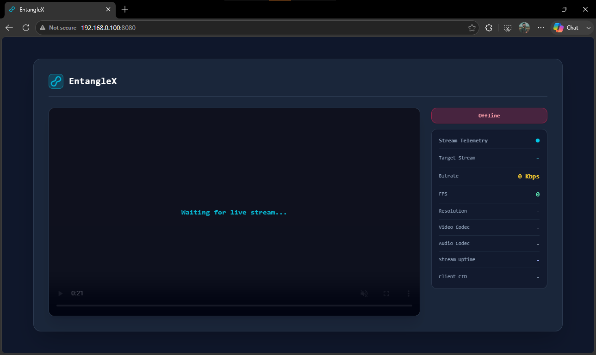
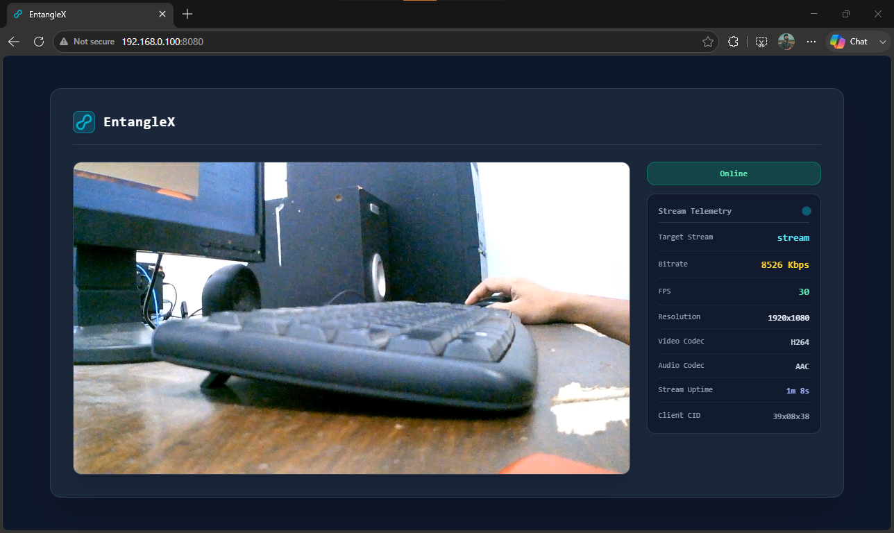
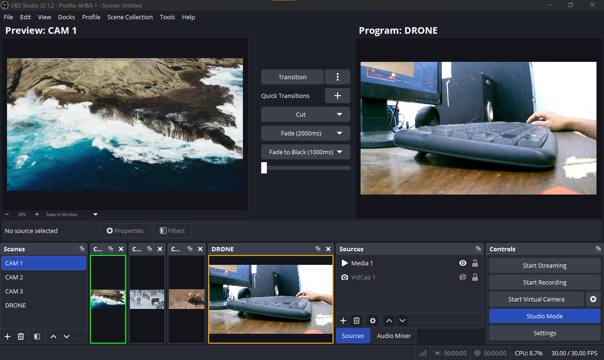

# Entanglex RTMP & SRT Streaming Server

**Entanglex** adalah proyek pembangunan server *media streaming* independen menggunakan Mini PC berbasis sistem operasi **Debian 13**. Server ini bertindak sebagai perantara yang menerima input *stream* RTMP dari perangkat klien, menyajikannya secara *real-time* via Web UI/HTTP Live Streaming, serta mentransmisikannya ulang (*relay*) ke seluruh jaringan lokal menggunakan protokol berlatensi rendah **SRT (Secure Reliable Transport)**.

---

## 💡 Konsep & Arsitektur Sistem

1. **RTMP Ingest (Input)**
   * Klien RTMP (seperti **USB Camera**, aplikasi **Larix Broadcaster**, atau **DJI Fly**) mengirimkan *live stream* ke Server Entanglex.
2. **Monitoring & Web Server**
   * Aliran video disajikan secara langsung dan dapat diakses melalui browser pada alamat IP Server Entanglex (Port `8080`).
3. **SRT Redistribution (Relay)**
   * Server mentransmisikan ulang sinyal video ke jaringan lokal (*LAN*) menggunakan protokol SRT.
   * Perangkat atau komputer mana pun di jaringan yang sama dapat menangkap sinyal ini menggunakan **VLC Media Player**, **OBS Studio** (menggunakan plugin GStreamer/SRT), atau pemutar media pendukung lainnya.

> **Catatan Implementasi:**  
> Versi saat ini difokuskan untuk menangani **1 Klien RTMP** secara stabil. Pengembangan lebih lanjut (*multi-client RTMP ingest*) akan diimplementasikan pada versi berikutnya.

---

## 📋 Prasyarat Sistem

* **Hardware**: Mini PC dengan OS **Debian 13 (Bookworm/Trixie)**
* **User System**: User non-root (contoh pada panduan ini: `ubdl`)
* **Koneksi Jaringan**: Terhubung ke jaringan lokal (LAN) dengan IP static/terkonfigurasi.

---

## 🛠️ Langkah-Langkah Instalasi & Konfigurasi

### Langkah 1: Konfigurasi Akses & Hak Akses Sudo

Langkah pertama adalah memberikan akses `sudo` kepada pengguna utama (`ubdl`) agar dapat mengeksekusi perintah administratif tanpa harus berada dalam sesi root.

```bash
# Masuk ke sesi root
su -

# Install utilitas sudo
apt update && apt install sudo -y

# Tambahkan user 'ubdl' ke dalam grup sudo
usermod -aG sudo ubdl

# Muat ulang sistem
reboot
```

---

### Langkah 2: Instalasi Dependensi System

Setelah sistem di-*reboot*, masuk kembali menggunakan user `ubdl`. Selanjutnya, install seluruh perangkat lunak pendukung dan dependensi *build tools* yang diperlukan.

```bash
sudo apt update
sudo apt install -y git build-essential python3 python3-flask ffmpeg pkg-config unzip tclsh cmake autoconf automake libtool
```

---

### Langkah 3: Kompilasi & Konfigurasi SRS (Simple Realtime Server)

SRS (Simple Realtime Server) digunakan sebagai *core media engine* untuk menangani protokol RTMP.

```bash
# Clone repositori SRS (Release v5.0)
sudo git clone -b 5.0release https://github.com/ossrs/srs.git /opt/entanglex-srs

# Buat direktori penyimpanan log & data
sudo mkdir -p /opt/entanglex-srs/storage

# Kompilasi SRS dari source code
cd /opt/entanglex-srs/trunk
sudo ./configure
sudo make

# Ubah kepemilikan direktori ke user ubdl
sudo chown -R ubdl:ubdl /opt/entanglex-srs
```

---

### Langkah 4: Deployment Aplikasi Web Entanglex

Aplikasi Web Entanglex berbasis Flask bertindak sebagai antarmuka pengelola dan pemutar video pada port 8080.

```bash
# Clone repositori aplikasi Entanglex
sudo git clone https://github.com/ubaidillahdl/entanglex-app.git /opt/entanglex-app

# Sesuaikan hak akses direktori
sudo chown -R ubdl:ubdl /opt/entanglex-app

# Buat symbolic link untuk konfigurasi SRS
ln -sf /opt/entanglex-app/deploy/srs.conf /opt/entanglex-srs/trunk/conf/srs.conf
```

---

## 🧪 Pre-Testing (Uji Coba Manual)

Sebelum mengonfigurasi layanan otomatis (*daemon/service*), jalankan pengujian manual untuk memastikan setiap komponen berjalan dengan baik. Buka 3 jendela terminal terpisah:

* **Terminal 1 (Menjalankan SRS Server):**
  ```bash
  cd /opt/entanglex-srs/trunk
  ./objs/srs -c conf/srs.conf
  ```

* **Terminal 2 (Menjalankan Web Application):**
  ```bash
  cd /opt/entanglex-app
  python3 app.py
  ```

* **Terminal 3 (Menjalankan SRT Relay via FFmpeg):**
  ```bash
  ffmpeg -i rtmp://127.0.0.1/live/stream -c:v copy -bsf:v h264_mp4toannexb -c:a copy -f mpegts "srt://192.168.0.10:9999?mode=caller&pkt_size=1316"
  ```

> **Verifikasi Pengujian:**
> 1. Kirimkan input RTMP dari perangkat klien ke alamat Server SRS (`rtmp://<IP_SERVER>/live/stream`).
> 2. Buka browser di `http://<IP_SERVER>:8080` untuk melihat tampilan pemutar web.
> 3. Konfigurasi Windows Firewall dengan membuka port 9999 (TCP/UDP) atau nonaktifkan sementara untuk keperluan pengujian.
> 4. Buka OBS Studio di komputer penerima, tambahkan Source **GStreamer**, lalu gunakan konfigurasi berikut:
>
>    **Pipeline String:**
>    ```text
>    srtsrc uri=srt://0.0.0.0:9999?mode=listener&latency=150 ! queue max-size-buffers=5 ! tsdemux ! queue max-size-buffers=5 ! h264parse ! avdec_h264 max-threads=4 ! videoconvert ! video.
>    ```
>
>    **Pengaturan Opsi GStreamer Source di OBS:**
>    * **Time Stamps & Sync:**
>      * `[X]` Use pipeline time stamps (video)
>      * `[ ]` Use pipeline time stamps (audio)
>      * `[ ]` Sync appsink to clock (video)
>      * `[ ]` Sync appsink to clock (audio)
>      * `[X]` Disable asynchronous state change in appsink (video)
>      * `[ ]` Disable asynchronous state change in appsink (audio)
>      * `[X]` Try to restart when end of stream is reached
>      * `[X]` Try to restart after pipeline encountered an error
>    * **Buffering & Timeout:**
>      * Error timeout (ms): `1000`
>      * `[ ]` Stop pipeline when hidden
>      * `[X]` Clear image data after end-of-stream or error
>      * `[X]` Disable video sink buffer
>      * `[X]` Drop video when sink is not fast enough
>      * `[ ]` Disable audio sink buffer
>      * `[ ]` Drop audio when sink is not fast enough
>      * `[X]` Disable buffering in OBS


---

## 🚀 Automasi Service Menggunakan Supervisor

Agar seluruh proses berjalan secara otomatis saat sistem boot dan dapat di-restart secara mandiri jika terjadi *crash*, kita menggunakan **Supervisor process manager**.

### 1. Instalasi Supervisor
```bash
sudo apt update
sudo apt install supervisor -y
```

### 2. Membuat Konfigurasi Service Entanglex
Buat file konfigurasi supervisor baru:
```bash
sudo nano /etc/supervisor/conf.d/entanglex.conf
```

Isikan file tersebut dengan konfigurasi berikut:

```ini
[program:entanglex-srs]
process_name=%(program_name)s
command=/opt/entanglex-srs/trunk/objs/srs -c conf/srs.conf
directory=/opt/entanglex-srs/trunk
autostart=true
autorestart=true
user=root
redirect_stderr=true
stdout_logfile=/opt/entanglex-srs/storage/srs.log
stderr_logfile=/opt/entanglex-srs/storage/srs-error.log

[program:entanglex-app]
process_name=%(program_name)s
command=python3 /opt/entanglex-app/app.py
directory=/opt/entanglex-app
autostart=true
autorestart=true
user=root	
redirect_stderr=true
stdout_logfile=/opt/entanglex-app/storage/app.log
stderr_logfile=/opt/entanglex-app/storage/app-error.log

[program:entanglex-srt-relay]
process_name=%(program_name)s
command=ffmpeg -i rtmp://127.0.0.1/live/stream -c:v copy -bsf:v h264_mp4toannexb -c:a copy -f mpegts "srt://192.168.0.10:9999?mode=caller&pkt_size=1316"
autostart=true
autorestart=true
user=root
startretries=999
startsecs=2
redirect_stderr=true
stdout_logfile=/opt/entanglex-srs/storage/srt-relay.log
```

### 3. Menerapkan & Mengaktifkan Layanan

```bash
# Memuat ulang konfigurasi supervisor
sudo supervisorctl reread
sudo supervisorctl update

# Memeriksa status setiap proses
sudo supervisorctl status

# Mengaktifkan supervisor saat sistem booting
sudo systemctl enable supervisor
sudo systemctl start supervisor
sudo systemctl status supervisor
```

---

## 📌 Rencana Pengembangan (Roadmap)

- [x] Mendukung 1 input client RTMP.
- [x] Web Monitoring bawaan pada Port 8080.
- [x] Transmisi ulang berlatensi rendah berbasis SRT Relay.
- [ ] Support Multi-Client RTMP Ingest (Mendukung beberapa kamera/klien secara bersamaan).
- [ ] Manajemen Stream Dynamic via Web Interface.


<table>
  <tr>
    <td align="center">
      <b>Web App Offline</b><br>
      
    </td>
    <td align="center">
      <b>Web App Online</b><br>
      
    </td>
  </tr>
  <tr>
    <td colspan="2" align="center">
      <b>OBS Receiver</b><br>
      
    </td>
  </tr>
</table>